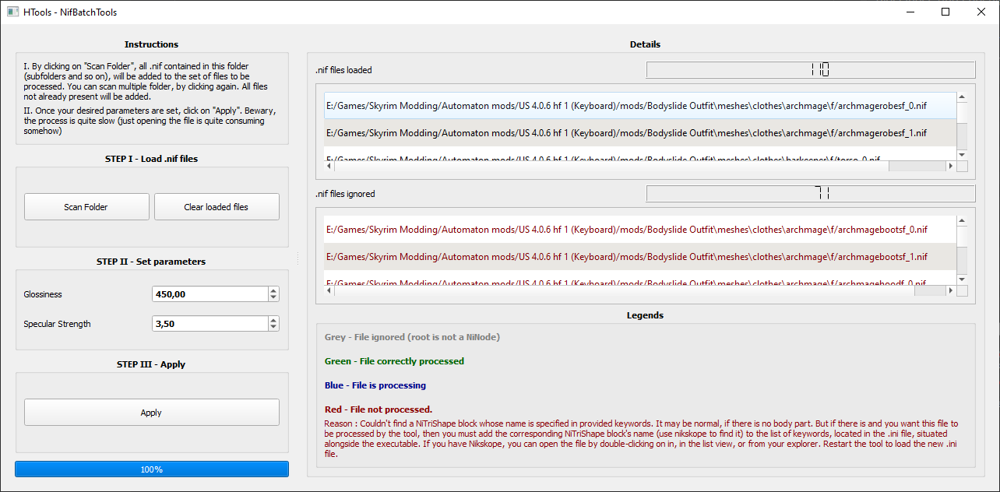
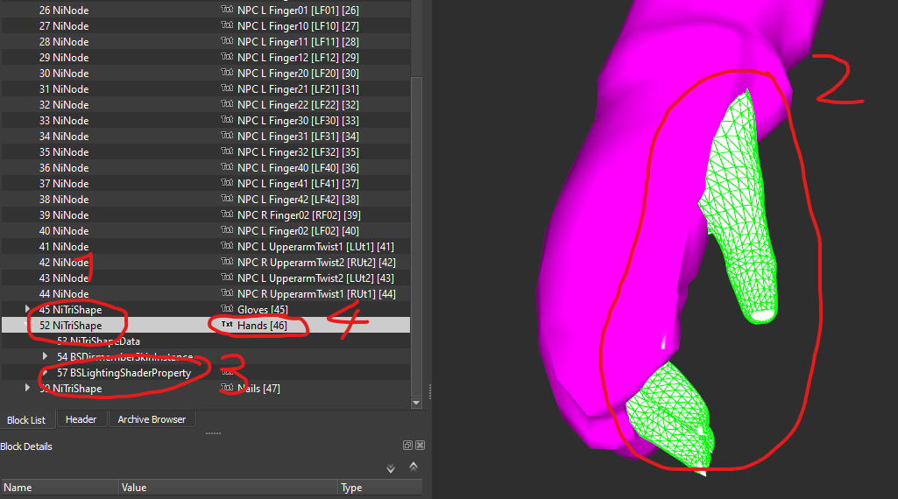

# HTool - NifBatchTools

Tool to batch .nif files, to apply glossiness and specular strength value to body parts (Head, body, hand, feet)

__WARNING :__ The tool is in BETA, I strongly advise you to use this tool only on __generated meshes from Bodyslide !__

## Description



This tool will scan specified folder to find relevant .nif files, in order to modify the glossiness and specular strength
of the body parts. To do so, the tool is looking in the .nif file, a block whose name is matching one of the provided keywords,
so that only body parts are affected. 

__Verified on Skyrim Legendary Edition and with UUNP meshes. It may works with Special Edition and CBBE bodies, but you
may have to adjust the keywords, so that the meshes are not ignored__

## Installation

### Requirements

Not a hard requirement, but if Nifskope is installed and set as the default program to open `.nif` files, you will be able to
open files from the tool, by double-clicking on an item from a list view.

__Note :__ I'm using [PyInstaller](https://www.pyinstaller.org/) to bundle the program into an executable :
* One big .exe file
* A directory containing an .exe, but also dependencies
 Two options are possibleFlagged as a threat by 4 out of 70 engines. So I also provide an archive 

I provide the two options because, when using [VirusTotal](https://www.virustotal.com/gui/home/upload), the one big .exe file
is flagged by 4 engines out of 70, while the archive is not. You can also launch the tool from source, if you prefer.
 
### From executable (one file)
Run `HTool-NifBatchTools.exe` anywhere.

### From archive (directory with executable and dependencies)
Extract anywhere and run `HTool-NifBatchTools.exe`

### From source
If you do not want to use the provided executable, you can launch the tool from the source code, available on 
[GitHub](https://github.com/Hyperen0r/HTool_NifBatchTools). See section __Tools/Libraries used__.


## How to use

1. __Scan folders__ where .nif files are located. Preferably, the one where the meshes generated by bodyslide are generated.
Scan as many folders as you want. Press "Del", to delete unwanted items.

2. Set desired __glossiness__ and __specular strength__

3. Click on __"Apply"__ and wait. The process is sadly quite slow. On my system it takes approximatively 13 minutes to patch
100 meshes. 

__Also, the gui will be mostly unresponsive (moving, resizing the window is near impossible). If the completion
pourcentage has not changed for a very long time, the application may have crashed. To report an issue, please include the log file,
situated alongside the executable.__

If NifSkope is installed and set as the default program to open `.nif` files, double-clicking on an item of a list view will open it, in NifSkope.

## F.A.Q

* __What are the default keywords ?__

_UUNP, FemaleHead, Hands, Feet, CL0, CL1_

* __How can I add keywords ?__

1. _Open htool.ini (located alongside the .exe. If not, run the tool once to generate the default one)._
2. _Add your entry to the list of keywords, e.g: `keywords= keyword1, your_keyword, ...`_

* __How can I set the default value for glossiness and specular strength ?__

1. _Open htool.ini (located alongside the .exe. If not, run the tool once to generate the default one)._
2. _Find those lines and modify accordingly :_
```
glossiness = 500.0
specularstrength = 5.0
```

* __My meshes are ignored/grey/red/not processed__

The goal of this tool is to affect only body parts. So by using keywords, only the block matching one of the keyword 
will see his glossiness and specular strength modified. If you need a block to be processed, add his name to the
keywords (provided by the .ini file situated alongside the executable. If not, run the tool once to generate the 
default one). To find the name, you need to open the mesh with [NifSkope](https://github.com/niftools/nifskope/releases). 
You are looking for a block of type `NiTriShape` __(1)__ that, when selected, highlight the vertices of a body part __(2)__. 
The name is situated on the same line in the second column __(4)__. See image below : 

## Tools/Libraries used

* Python 3.7.4 (PyCharm IDE)
* [Pyffi](https://github.com/niftools/pyffi)_, to read .nif files_
* [PySide2](https://wiki.qt.io/Qt_for_Python)_, to build GUI_
* [PyInstaller](https://www.pyinstaller.org/)_, to build installer_

Command used to bundle program as onefile :
```
pyinstaller --windowed --name="HTool-NifBatchTools" --onefile --add-binary="venv/Lib/site-packages/pyffi/;./pyffi/" --add-data="README.md;." src/HTool.py
```

Command used to bundle program as a directory :
```
pyinstaller --windowed --name="HTool-NifBatchTools" --add-binary="venv/Lib/site-packages/pyffi/;./pyffi/" --add-data="README.md;." src/HTool.py
```
## Known problems

* __Applying patch is very slow__

_Sadly the read and write operation of the plugin used to manipulate .nif files are very slow (almost 100% of the compute time)_
